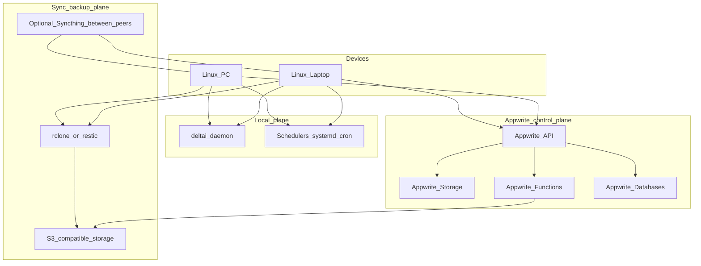
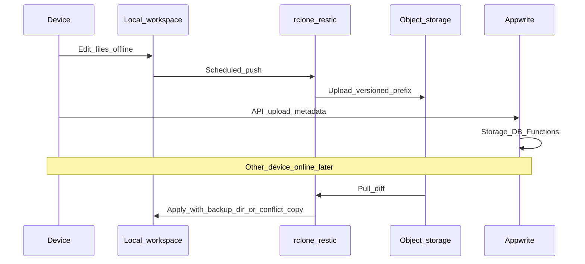

# Linux workstation cloud sync and maintainer architecture

This document describes a **professional-grade** layout for multi-device Linux workstations: local automation (including deltai), **object-storage backup/sync**, and **Appwrite** as the control plane for remote files and heavy compute when only one device is online (for example, a laptop abroad while a desktop is powered off).

Companion implementation in this repository:

- Extension: [`project/extensions/workstation_cloud/`](../project/extensions/workstation_cloud/)
- Scripts: [`scripts/workstation_preflight.py`](../scripts/workstation_preflight.py), [`scripts/workstation_sync_manifest.py`](../scripts/workstation_sync_manifest.py)
- Existing backup reference: [`scripts/backup_s3.py`](../scripts/backup_s3.py) (deltai `data/` to S3)

---

## System architecture



### Layer responsibilities

| Layer | Responsibility |
|--------|----------------|
| **deltai** | Orchestration, RAG, tools; optional triggers via extension routes and scripts (no cloud FS engine in core). |
| **Sync / backup** | Durable copies to **S3-compatible** storage; optional **Syncthing** for peer sync when multiple devices are online. |
| **Appwrite** | **Remote authority** when one machine is off: Storage for blobs, Databases for metadata and job state, **Functions** for CPU-heavy or portal/backend work. |
| **Linux maintainer** | `systemd` user timers, cron, [`project/core/arch_update_guard/`](../project/core/arch_update_guard/) where applicable. |

### Data flow (reconcile)



---

## Reliability norms (operations standard)

1. **3-2-1 backups** — At least three total copies, on two different media, one off-site. Map to: primary disk, object storage (second medium), optional second region or WORM bucket (third copy).
2. **Encryption** — Server-side (SSE-S3/SSE-KMS) and/or client-side (`restic`, `rclone crypt`). **Secrets only via environment** or secret managers; never commit keys (same posture as [`project/.env.example`](../project/.env.example)).
3. **Integrity** — Content hashes in manifests (see `workstation_sync_manifest.py`); periodic **restore drills** (restore to a temp directory and verify checksums or spot-checks).
4. **Immutability / versioning** — Enable bucket versioning or object lock on **backup** prefixes; use a separate **mutable sync** prefix for day-to-day replication if needed.
5. **Conflict and offline model** — Prefer **visible conflicts** over silent last-write-wins for important trees: e.g. `rclone copy --backup-dir`, Syncthing file versioning, or explicit conflict filenames. Document the chosen policy per folder.
6. **Observability** — Structured logs from scripts; monitor last successful backup/manifest age; optional `GET /ext/workstation_cloud/status` for a quick health snapshot (no secrets in response).
7. **Appwrite compatibility** — Use **HTTPS APIs** from scripts or the extension only. Configure projects (bucket IDs, function IDs, API keys) via env. If a **browser** talks to Appwrite directly, configure **CORS** and least-privilege API keys. The deltai dashboard remains a single file ([`project/static/index.html`](../project/static/index.html)); a separate portal can live entirely on Appwrite or another host.

### Security posture (deltai)

deltai targets **localhost** by default. There is **no app-level auth** on most routes; **`run_shell` is not a sandbox**. Do not expose the daemon to untrusted networks without a reverse proxy and authentication. See [CLAUDE.md](../CLAUDE.md) (Security posture).

---

## Data classification

| Class | Examples | Sync / backup strategy |
|--------|-----------|-------------------------|
| **Shared workspace** | Project repos, documents you need on all machines | Object-store hub ± Syncthing; Appwrite Storage for app-integrated files |
| **Heavy artifacts** | Build outputs, large datasets | Prefer object storage or Appwrite Storage; avoid naive full-tree bi-sync |
| **deltai runtime** | `data/chromadb`, SQLite, knowledge | [`scripts/backup_s3.py`](../scripts/backup_s3.py) or equivalent; device-local caches |
| **Secrets** | API keys, SSH keys | Never synced via plaintext mirrors; use password manager / per-device credentials |
| **Device-local** | GPU caches, VM images | Exclude from global sync; regenerate or restore from archives |

---

## Multi-device scenarios

### Both devices online

- Optional **Syncthing** mesh for low-latency convergence.
- Scheduled **restic** or **rclone** to object storage for durability.
- Push high-signal status into deltai via existing **`POST /ingest`** (see [CLAUDE.md](../CLAUDE.md)).

### Laptop only (e.g. international travel, desktop off)

- **Appwrite Storage + Databases** hold shared artifacts and metadata.
- **Appwrite Functions** (or functions that trigger external runners) cover **heavy compute** and portal-style backends.
- deltai on the laptop continues to use **local** models when available; optional cloud LLM remains a separate, explicitly configured path.

### Desktop returns online

- Run **`workstation_sync_manifest.py`** on each side; compare manifests or object listings.
- Reconcile with **human-approved** `rclone`/`restic` commands; avoid blind auto-merge on critical directories.

---

## Operational runbook

### Environment variables (extension + scripts)

| Variable | Purpose |
|----------|---------|
| `DELTA_DATA_DIR` | Base for deltai data and extension state (default under `~/.local/share/deltai`). |
| `APPWRITE_ENDPOINT` | HTTPS endpoint of your Appwrite project (e.g. `https://cloud.appwrite.io/v1` or self-hosted). |
| `APPWRITE_PROJECT_ID` | Project ID (optional; used for sanity checks / docs). |
| `WORKSTATION_S3_BUCKET` | Optional bucket name for preflight checks. |
| `WORKSTATION_MANIFEST_ROOTS` | Comma-separated absolute or `~` paths for manifest generation. |
| `WORKSTATION_MANIFEST_CONFIG` | Optional JSON file listing roots (see script docstring). |
| `WORKSTATION_RCLONE_REMOTE` | Optional remote name for safe read-only `rclone version` / listing tooling. |

Never log values of API keys. Use `APPWRITE_API_KEY` only in local env or secret stores; the extension **does not** expose it via HTTP.

### systemd user timer (example)

Run preflight daily (adjust paths and env):

```ini
# ~/.config/systemd/user/workstation-preflight.service
[Unit]
Description=Workstation cloud preflight checks

[Service]
Type=oneshot
EnvironmentFile=%h/deltai/project/.env
ExecStart=%h/deltai/venv/bin/python %h/deltai/scripts/workstation_preflight.py
```

```ini
# ~/.config/systemd/user/workstation-preflight.timer
[Unit]
Description=Daily workstation preflight

[Timer]
OnCalendar=daily
Persistent=true

[Install]
WantedBy=timers.target
```

Enable with: `systemctl --user daemon-reload && systemctl --user enable --now workstation-preflight.timer`

### Restore drill checklist

1. Choose a random historical backup prefix or restic snapshot.
2. Restore to a **temporary** directory (not over production).
3. Verify file counts and spot-check hashes against a known manifest.
4. Document time to restore and any failures.

---

## Out of scope for deltai core

- A full custom sync engine inside the daemon.
- Domain-specific ingest parsers (see project boundaries in [AGENTS.md](../AGENTS.md)).
- Splitting [`project/static/index.html`](../project/static/index.html) into a multi-file frontend unless you explicitly migrate.

---

## Risk summary

- **Split-brain** is inevitable with offline edits; manifests and `--backup-dir`-style semantics keep conflicts **visible**.
- Treat **Appwrite** and object storage as **eventually consistent** with your chosen RPO/RTO; test failover paths regularly.
